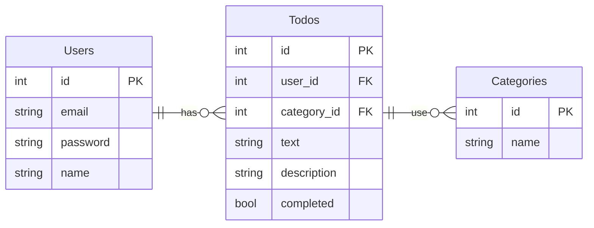
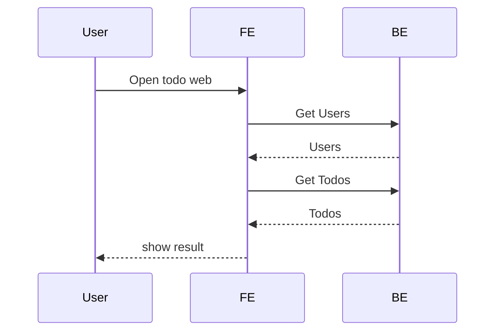
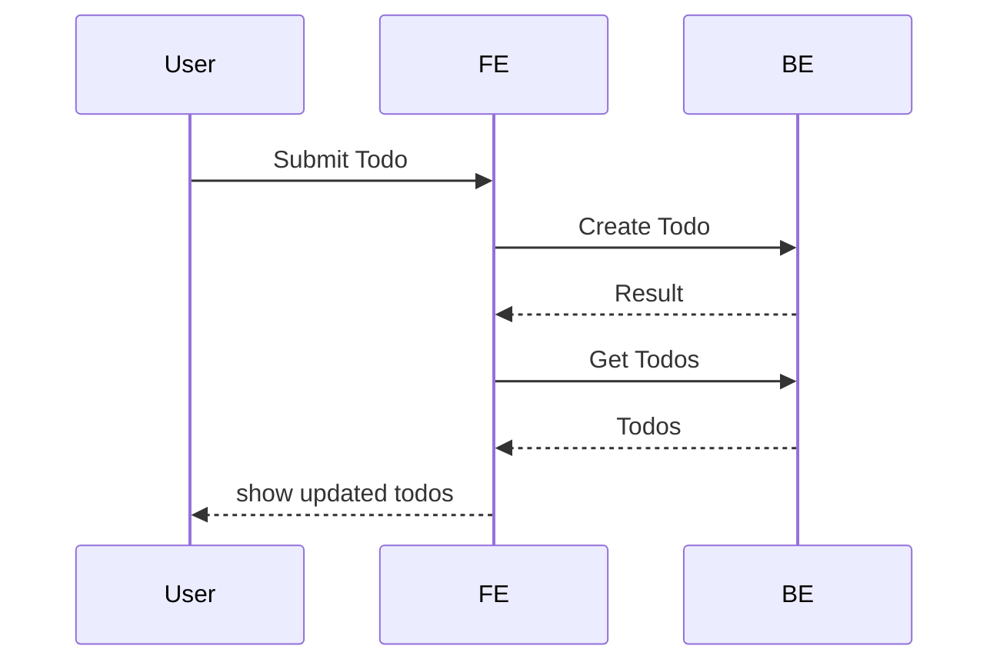
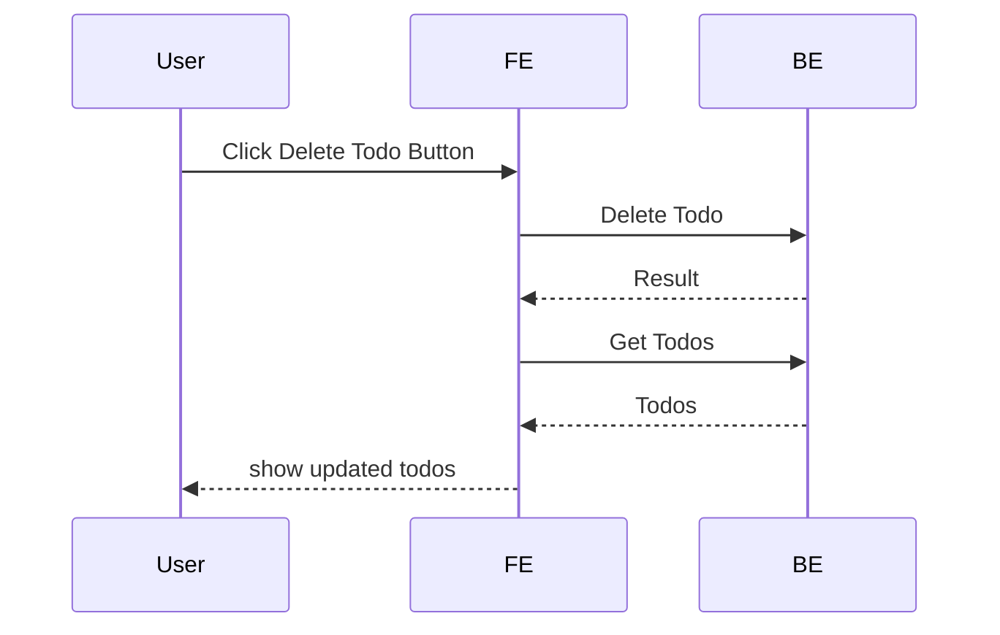

# Coding Test for L2 Engineer (Mid Level) 
Duration: 45-60 minutes | Allowed Tools: AI Assistant (ChatGPT, Claude, etc.) 
## General Instructions 
1.  You are encouraged to use AI assistants to help with coding and Design 
2.  Create the system design to help you clear understanding about the application goals 
3.  Focus on making your code work first, then improve readability 
4.  Add simple comments where needed 
5.  Don't worry about advanced features - keep it simple and functional

## Problem 1: Simple To-Do List 
Description 
Build a simple To-Do List application using Go for the backend and basic 
HTML/CSS/JavaScript for the frontend. Users should be able to add, view, and remove tasks. 
Backend Requirements (Go with Gorilla Mux or standard library) 
Product Requirements: 
1.  This apps is collaborated team to do list or ticket 
2.  Users can collaborate through the board 
3.  There is a feature to integrate to an AI service to predict the to-do list or ticket category. 

- Assuming the service is existing and just to call to POST https://ai.example.com/predict-category 

- Body request 

```json     
{ 
  "file": "base64_stringify_pdf" 
} 
```

- Result 
 

```json
{ 
  "data": { 
        "category": "string" 
    }, 
    "status": "string", 
    "message": "string" 
}
```
 
4.  User able to refine the result, and refined result using for data training later 
 
 
### Design System: 
Create design architecture to handle this apps 
-  ERD - Database model  
-  Design communication flow 
-  Any Diagrams you need to make junior dev understand how to implement it 



[comment]: <> ( 
    TodoCategories {
        int id PK
        int todo_id FK
        int category_id FK
    }
    TodoCategories : "has"
    Categories ||--o{ TodoCategories : "use"
 )

**Open Web**

**Create Todo**

**Delete Todo**


**You need to create 3 simple API endpoints:**
1.  GET /todos - Return all todos as JSON 
2.  POST /todos - Add a new todo 
3.  DELETE /todos/{id} - Delete a todo by ID 
4.  Service to integrate to 3rd party service 
Todo Structure add the rest to make it right (keep it simple), example: 

```json
{ 
  "id": 1, 
  "text": "Buy groceries", 
  "completed": false 
} 
```

**What your Go backend should do:**
- Store todos in a simple slice (no database needed) 
- Give each todo a unique ID (you can use a counter) 
- Handle basic errors (like "todo not found") Go
- Enable CORS for frontend communication 
- Add anything to make the apps runs properly 
### Frontend Requirements (HTML + CSS + JavaScript) 
**Create a simple web page with:**
1.  A form to add new todos: 
    - One text input for the todo text 
    - One submit button 
2.  A list showing all todos: 
    - Display the todo text 
    - Show a delete button for each todo 
3.  Basic styling: 
    - Make it look clean (doesn't need to be fancy) 
    - Maybe add some colors or spacing 
    - No need for responsive design 

**What your frontend should do:**
- Add new todos when form is submitted 
- Display all todos from the server 
- Delete todos when delete button is clicked 
- Refresh the todo list after adding/deleting 
- Integrate properly with BE 
- Add anything to make the apps runs properly 
 
Starter Code Structure 
You can start with this basic structure: 
#### Backend (main.go): 

```go 
package main 
import ( 
    "encoding/json" 
    "fmt" 
    "log" 
    "net/http" 
    "strconv" 
     
    "github.com/gorilla/mux" 
) 
 
type Todo struct { 
    ID        int    `json:"id"` 
    Text      string `json:"text"` 
    Completed bool   `json:"completed"` 
} 
 
var todos []Todo 
var nextID = 1 
 
func main() { 
    // Initialize with sample data 
    todos = []Todo{ 
        {ID: 1, Text: "Sample todo", Completed: false}, 
    } 
    nextID = 2 
 
    r := mux.NewRouter() 
     
    // Your API routes here 
     
    fmt.Println("Server starting on :8080") 
    log.Fatal(http.ListenAndServe(":8080", r)) 
} 
``` 

// Your handler functions here 
 
#### Frontend (index.html): 
```html
<!DOCTYPE html> 
<html> 
<head> 
    <title>Simple To-Do List</title> 
    <style> 
        body { 
            font-family: Arial, sans-serif; 
            max-width: 600px; 
            margin: 50px auto; 
            padding: 20px; 
        } 
         
        /* Add your CSS styling here */ 
    </style> 
</head> 
<body> 
    <h1>My To-Do List</h1> 
     
    <form id="todoForm"> 
        <input type="text" id="todoText" placeholder="Enter a new todo..." required> 
        <button type="submit">Add Todo</button> 
    </form> 
     
    <div id="todoList"> 
        <!-- Todos will be displayed here --> 
    </div> 
     
    <script> 
        const API_BASE = 'http://localhost:8080'; 
         
        // Your JavaScript functions here 
         
        // Load todos when page loads 
        loadTodos(); 
    </script> 
</body> 
</html> 
```

**What We're Looking For:**
- Does it work? Can you add and delete todos successfully? 
- Code clarity: Is your Go code easy to understand? 
- Use of AI: How did you use AI to help solve problems? 
- Basic error handling: What happens if something goes wrong? 
- Go conventions: Do you follow basic Go naming and structure? 

**Dependencies:** 
You'll need to install Gorilla Mux: 
```sh
go mod init todo-app 
go get github.com/gorilla/mux 
```

#### Submission Requirements 
**For Problem 1:** 
- **main.go** - Your Go backend code 
- **go.mod** - Go module file 
- **index.html** - Your frontend code 
- **README.md** - Simple instructions on how to run your app 
- **ACTION_PLAN.md** - Add AI action Plan and All prompt you runs for your code 
- All prompts that are used in assisting to build this app. 

```sh
# Setup Instructions: 
# Initialize Go module 
go mod init todo-app 
 
# Install dependencies 
go get github.com/gorilla/mux 
 
# Run the application 
go run main.go 
```

**Success Tips:** 
1.  Start simple - Get basic functionality working first 
2.  Use AI effectively - Ask for Go-specific explanations 
3.  Test as you go - Use curl or Postman to test your API 
4.  Don't overcomplicate - Simple working code is better than complex broken code 
 
 
**Sample AI Prompts You Might Use:** 
- "How do I create a simple REST API with Go and Gorilla Mux?" 
- "What's the proper way to handle JSON in Go HTTP handlers?" 
- "How do I enable CORS in a Go web server?" 
- "What are common mistakes when building APIs in Go?" 

**Remember:** We want to see how you think through problems and use AI to help you learn and solve Go-specific issues. Focus on clean, idiomatic Go code. Good luck!